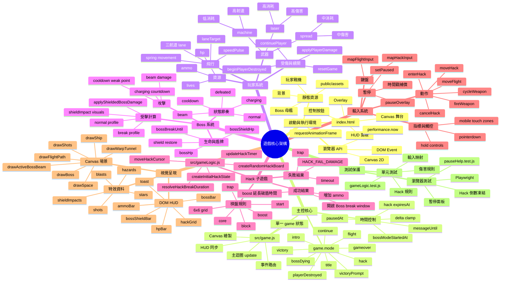

# 遊戲核心架構心智圖

## 核心解讀

- `src/game.js` 是遊戲執行期中樞，負責把輸入、狀態、時間、HUD 與 Canvas 畫面串起來。
- `src/gameLogic.js` 是純規則核心，處理 Hack 棋盤、傷害、盾牌與輸入映射，並由單元測試保護。
- 主要玩法閉環是：玩家飛行與開火、Boss 盾牌吸收、Hack 成功製造破盾窗口、破盾期間提高有效輸出，直到 Boss 進入 defeated/victory 流程。
