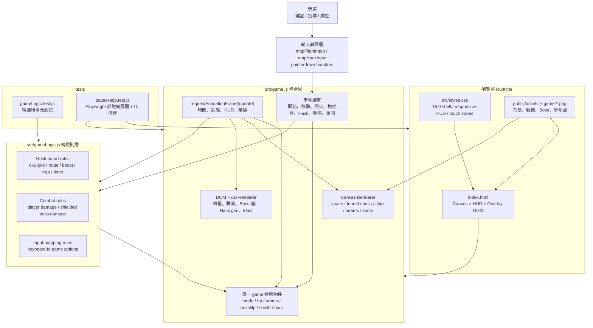
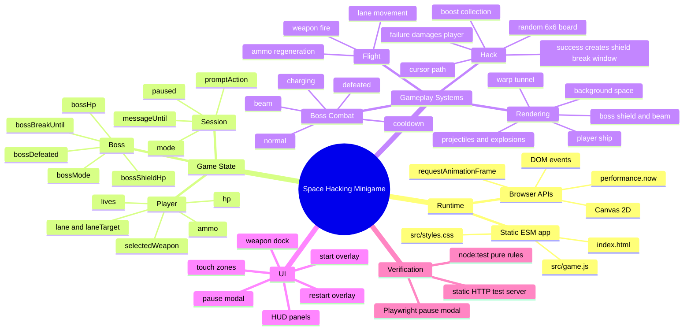
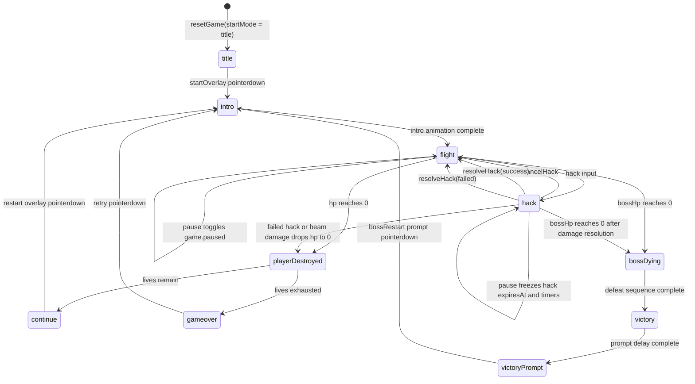
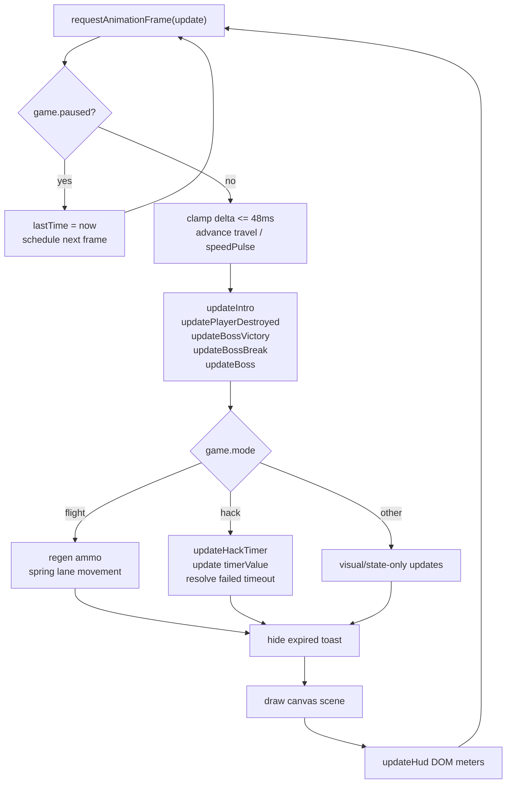
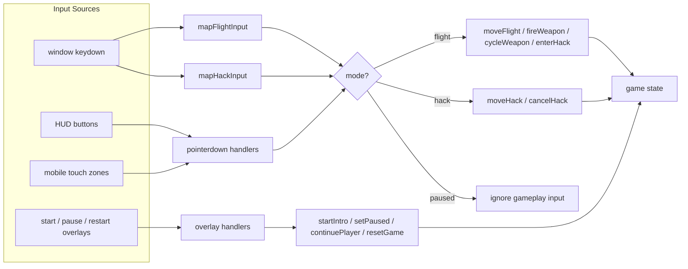
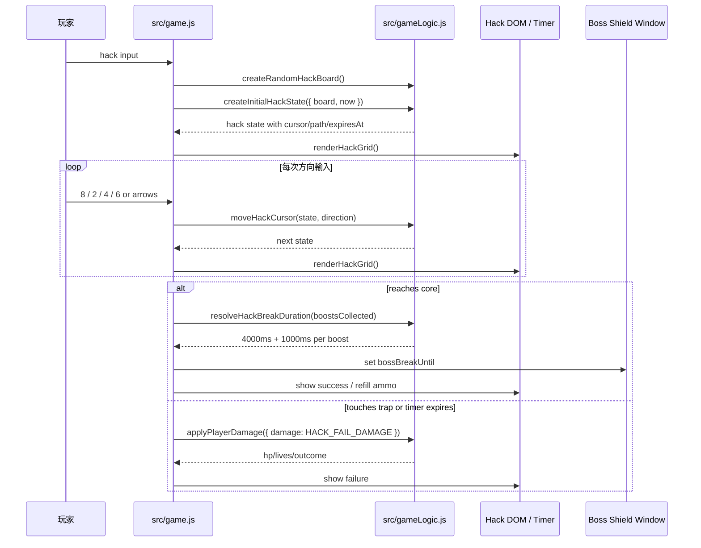
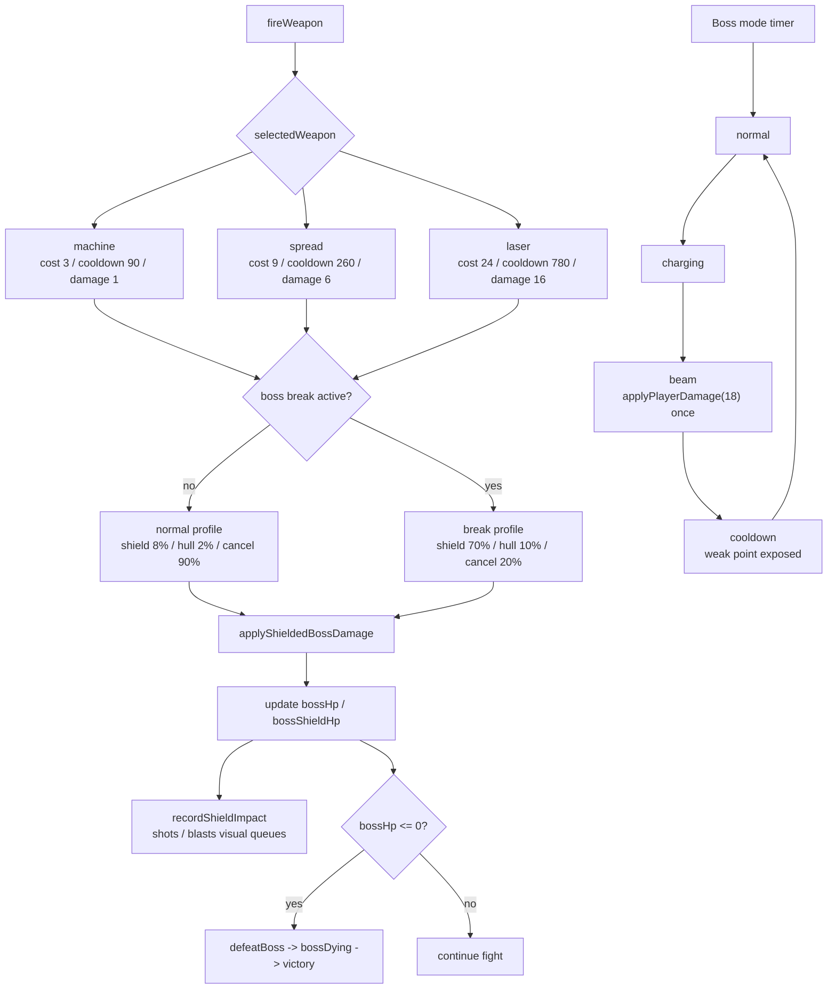
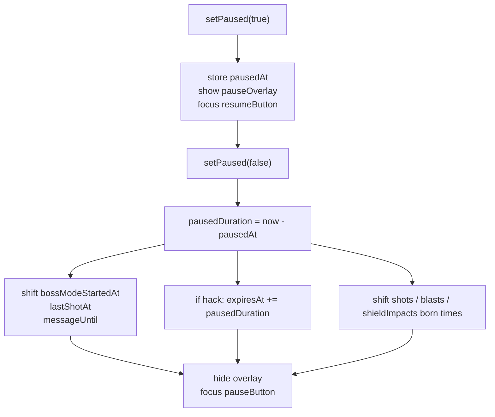
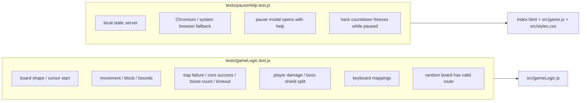

# Space Hacking Minigame 系統架構圖

本文件整理目前專案的整體架構。專案是一個無後端、無打包步驟的靜態 ESM 瀏覽器遊戲，由 `index.html` 掛載畫面與 HUD，`src/game.js` 負責執行期整合，`src/gameLogic.js` 負責可測的純遊戲規則。

## 1. 系統資訊圖

## 2. 架構心智圖

## 3. 檔案與責任分層

| Layer | File | Responsibility |
| --- | --- | --- |
| Entry shell | `index.html` | 定義 Canvas、HUD、控制按鈕、Hack panel、暫停與重開 overlay，並以 ESM 載入 `src/game.js`。 |
| Runtime orchestration | `src/game.js` | 持有 `game` 狀態、事件綁定、主迴圈、DOM/HUD 更新、Canvas 繪製、Boss/玩家狀態流程。 |
| Pure domain rules | `src/gameLogic.js` | 提供 Hack 棋盤、游標移動、計時、傷害計算、盾牌吸收、輸入映射等可單元測試規則。 |
| Presentation | `src/styles.css` | 建立 16:9 遊戲容器、HUD 版面、按鈕、觸控區、暫停面板與響應式配置。 |
| Media | `public/assets/*`, `game-*.png` | 遊戲中的飛船、Boss、背景與設計參考素材。 |
| Test harness | `tests/gameLogic.test.js` | 驗證純規則層的棋盤、傷害、輸入映射與隨機 Hack route。 |
| Browser test | `tests/pauseHelp.test.js` | 啟動本地靜態伺服器，用 Playwright 驗證暫停說明與 Hack 倒數暫停。 |

## 4. 遊戲狀態流程圖

## 5. Runtime 主迴圈

## 6. 輸入到動作資料流

## 7. Hack 子系統流程

## 8. 戰鬥與 Boss 盾牌流程

## 9. 暫停與時間補償流程

## 10. 測試覆蓋視圖

## 11. 架構觀察

- 目前架構是「靜態頁面 + 單檔 runtime orchestrator + 純邏輯模組」；沒有後端、資料庫、路由器或打包管線。
- `src/gameLogic.js` 的設計已經把高風險規則抽成純函式，測試成本低，是後續擴充 Hack board、Boss damage profile、輸入映射時最穩的切入點。
- `src/game.js` 同時承擔狀態機、事件、Canvas 繪製、HUD 更新與音效/提示節奏，是目前最大的耦合點；若遊戲繼續變大，最自然的下一步是把 `rendering`、`boss system`、`input system`、`hud system` 拆成模組。
- 暫停流程不是單純停止畫面，而是補償所有依賴 `performance.now()` 的時間戳，這是 Hack 倒數、Boss 節奏與子彈特效能同步恢復的關鍵。
